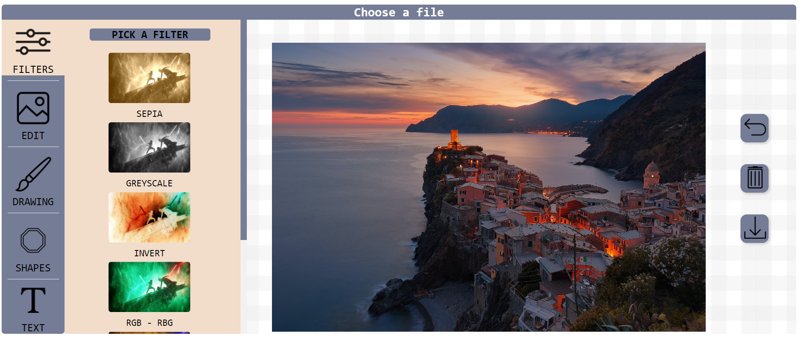

# 📷 Photo Editor  
> Photo editor using HTML5 Canvas. Has many features and easy to use.  

## 📌 Table of contents
- [About](#-about)
- [Features](#-features)
- [Demo](#-demo)
- [Missing a feature?](#-missing-a-feature)
- [License](#-license)

## 🌌 About

The photo editor couldn’t be easier to use. No complicated tools or confusing interface – just simple obvious tools that transform your photo. Enhance your photo in one click with the range of filters. Crop and resize your photo in mere seconds. Add different shaped figures and text.

## 📚 Features

## 🎬 Demo

## 🖖 Missing a feature?

Feel free to **file a new issue** with a propriate title and description on the [stormtrooper01/photoeditor](https://github.com/stormtrooper01/photoeditor/issues) repository.

## 📃 License

This particular photo editor is being making under terms of the [MIT License](https://github.com/stormtrooper01/photoeditor/blob/main/LICENSE).
